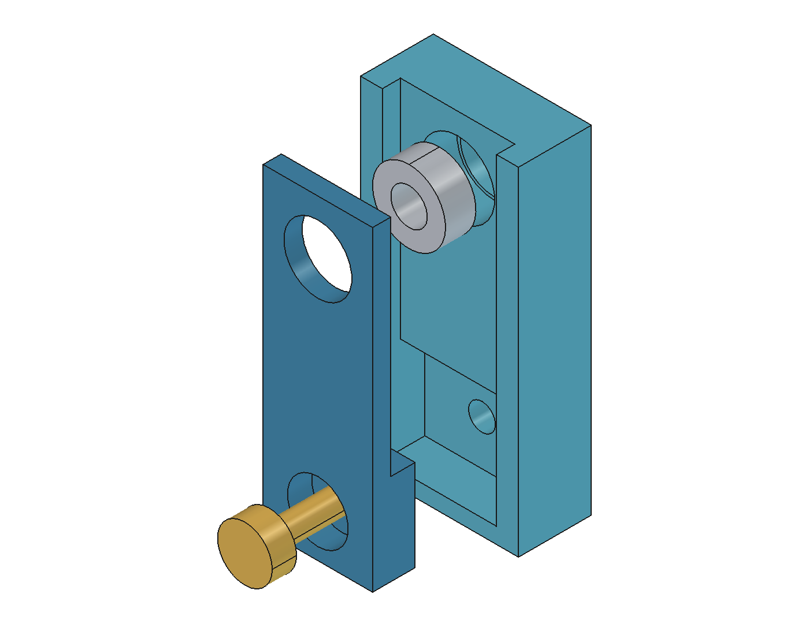

# Purchased bearings and removable keepers

Design decision, 2026-09-29. The user confirms the original final-cart generic
**3 × 6 × 2.5 mm** bearings were purchased; retain four, without buying flanged
or differently sized replacements.

## Architecture and reason

Each bearing sits in a rigid round seat against an integral rear shoulder.
A small front keeper closes the other end. Four identical keepers replace
the eight integral release arms. Each keeper uses one ordinary **M2×6 screw
and M2 hex nut**; its broad pocket guides limit gross rotation, and the screw
locks the aligned position. The screw clamps
the keeper onto a hard frame seat, without intended pressure on the bearing.
Radial support, axial bearing capture and shaft grip remain separate functions.

Illustrative unit view; the grey annulus is the bearing envelope, not a model of
the actual races or shields. Production geometry remains in the native CAD.

This adds four small replaceable prints and four screw/nut pairs, using existing
hardware types. It removes elastic latch release, two-blade service and dependence
on printed-arm recovery. It does not qualify retention force, stiffness, creep
or the received bearing's shield geometry. A keeper can be replaced independently
of the frame. The paired servo/input module remains intentionally detachable.

A radial split clamp was rejected: screw closure could distort a miniature
bearing or shift its axis. Interference can reduce miniature-bearing internal
clearance; this design therefore retains a fixed locating bore and separates
axial retention from radial squeezing. [Dynaroll mounting guidance](https://www.dynaroll.com/mounting.asp)
Different bearing outer diameters/widths are not interchangeable here. Any later
size change requires corresponding seat geometry and renewed alignment checks,
not extra looseness or tightening one housing around multiple sizes.

## Nominal dimensions and unchanged datums

Cup coordinates use +Y toward the rear shoulder; the nominal bearing occupies
Y0..2.5 mm. Mirror the complete interface for the opposite side.

| Item | Nominal design value / limit |
| --- | --- |
| Bearing | Purchased generic Ø3 bore × Ø6 outside × 2.5 width; identity, tolerances and ring lands unmeasured |
| Fixed seat | Ø6.1 mm, continuous circular support across the nominal bearing width; a coupon/finishing trial, not a certified fit |
| Rear shoulder | Y2.5..4.0 mm; outer-ring contact only |
| Keeper retaining face | Y−0.5 mm; nominal 0.5 mm inward bearing float, no preload |
| Keeper opening | Ø5.6 mm; nominal 0.2 mm radial overlap at the Ø6 bearing edge |
| Keeper front | Y−2 mm; preserves nominal ±0.5 mm carrier travel through the separate rotor stops |
| Keeper fastener | M2×6 at Z−18 mm; head seat Y0 in a Ø5 mm recess, nominal 4 mm grip plus 1.6 mm nut leaves 0.4 mm tip projection; verify received hardware |
| Propulsor axes | 150 mm apart; 50 mm from nominal rail-contact plane |
| Bearings per rotor | Two, 70 mm between centres; each runs on a separate shaft stub joined by the carrier |
| Shaft grip / cut lengths | 10 mm grip; driven/idler/input rods remain 34/20/18 mm |

The lower fastening foot places its head below the axis, recessed nominally
flush with the keeper front surface to preserve rotor clearance. The current carrier still accepts
only the selected 40 mm propeller; a 50 mm propeller needs a replacement carrier.
No purchased bearing spacer, push-on ring, extra input bearing or new bearing
type is added.

## Fit and manufacturing limits

Ø6.1 against nominal Ø6 gives **0.1 mm diametral / 0.05 mm radial allowance**
in the nominal model. It is not a universal tolerance absorber or a requirement
to accept noticeable radial rocking. [Creallo's specification guide](https://creallo.com/ko/guide/design-spec-guide)
lists SLS/MJF general tolerance as ±0.3%, minimum ±0.3 mm, and a general assembly
gap of 0.3 mm. Those values do not qualify this precision interface; increasing
its clearance to cover all raw variation would sacrifice bearing location.

Print the production cup and keeper test pieces with the same PA12 process,
grade, finish and feature orientation as their respective production frame and
keeper exports. Inspect
the received bearing, seat and keeper together. Correct the bore by controlled
finishing or reprint after coupon measurement; do not force the bearing into an
undersized bore, squeeze it with the keeper, or accept a rocking oversized seat.
Check both bearing axes together after full-frame printing. A passing small
coupon does not establish full-frame straightness or alignment.

The Ø5.6 retaining opening still relies on the actual outer-ring land. Its
0.2 mm radial overlap is not a printable free-standing 0.2 mm wall, but contact
at the edge of a thicker keeper/shoulder. The retained Ø5.4 shield envelope is
reference geometry, not a measurement of this generic lot. Verify both faces
contact only the outer ring, accounting for chamfers and printing variation.
Stop if either keeper or shoulder rubs a shield. Removing the latch does not
remove this unresolved interface.

The keeper pocket's nominal 0.2 mm side allowance is assembly clearance,
not precision centring. Keeper displacement combines with the bearing's nominal
0.05 mm radial seat allowance and actual print error. Manually centre the keeper
opening on the received bearing before tightening; verify outer-ring coverage
and shield clearance around the opening. Check free rotation at both axial
limits after fastening. A centred nominal CAD check alone cannot prove those
contacts for a displaced keeper or bearing.

The hard frame seat must be reached before tightening can press the bearing.
Check positive axial clearance, free rotation before/after fastening, nut
engagement, keeper stability and carrier end travel. Reject binding, shield
rubbing or looseness; no qualified tightening torque is specified. No bearing
preload is intended. Shaft-clamp slip, bearing internal play and printed-part
creep remain separate physical checks.

## Assembly, inventory and verification scope

Remove the output carrier and its shaft stubs before bearing service. Release
the keeper screw/nut, remove the keeper, then withdraw the bearing inward.
For assembly, seat the bearing without pressing its shield/inner ring; fit the
keeper firmly against its frame seat, then check rotation and clearance before
reinstalling the carrier/stubs. Actual tool access and the ordered movement
must be represented by the final CAD service checks; no sprung-arm motion or
two-blade opening is required.

The current generated BOM and manufacturing manifest own installed/coupon
quantities. Keepers share one print SKU; the matching test piece is separate
from the flight assembly. Use saved-CAD validation bound to the current source
for geometry and service results; prior revisions do not qualify changed parts.
Physical fit, holding strength, loaded operation and PA12 creep remain unqualified.
